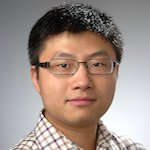
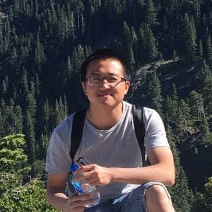
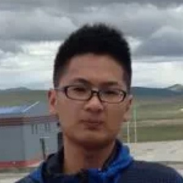

Current members
---

| Name | Role | Picture | Webpage |
| ---- | --- | --- | --- |
| Dr. Yuzhe Tang | Faculty |  | [[ecs.syr.edu/faculty/yuzhe](http://ecs.syr.edu/faculty/yuzhe)] |
| Ju Chen | PhD |  | [chenju2k6.github.io](http://chenju2k6.github.io/) |
| Kai Li | PhD |  | [likai1993.github.io](http://likai1993.github.io) |
| Vishal Kudale | Master | |
| Qinzhe Zhang | Master | |
| Qiwu Zou | Undergraduante | | | 
| Zhehu Yuan | Undergraduante |  | [[zhehuyuan.github.io](https://zhehuyuan.github.io/)] |
| Hao Zhou | Undergraduante | |
| Muzhen Li | Undergraduante | |
| Congcong Xie | Undergraduante | |

Alumni
---

- Visiting student: Cheng Xu [[webpage](https://xuc.me/)]
- Master students
    - Hari Krishna Gajarla, Haoyi Shi, Kang Lou, K. Areekijseree, Zihao Xing, Sahil Deepak Shah

